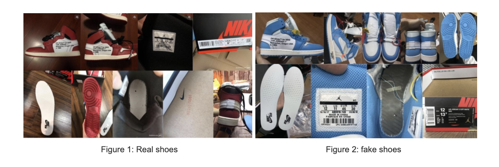

# Machine learning project

Group project for machine learning course at nmsu:

Goal: 

-  1. produce a reliable model to classify different photos of sneakers

-  2. produce a reliable model predict fake/real sneakers

- [x] used Keras CNN to train image sets

- [x] applied keras on the fly image augmentation.

- [x] different labels classification for sneakers.

- [x] train real/fake sneakers [accuracy 0.91].

- [x] predict real/fake sneakers[accuracy 0.72 ~ 0.77].

- [x] train multiclass label classifier [accuracy 0.78].

- [x] predict multiclass label classifier [accuracy 0.63].

